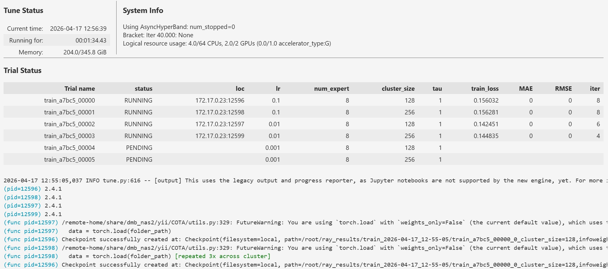

# COTA: Cluster Optimal Transport Alignment for Cross-Domain Recommendation

## What is this?

Source code of the thesis. Include all the code to implement procedure mentioned in the paper. Limited by upload file size, all original dataset JSON files and Book Domain MF model pre-trained weight file is not included.

Keywords: Cross-domain Recommendation, Cold-start Problem, Optimal Transport, Mixture-of-Experts, Prototype Learning

## Implementation

Implementation steps for task 1 (Movie-Music, beta = 20%):
1) Assuming you already installed pytorch, install **requirement.txt**.
2) Goto **variable.py**, change the variable **absolute_path** to your own project root, Ray Tune worker require absolute path.
3) Run Jupyter notebook **main-train.ipynb**.

*Note: In training process, Ray Tune save many checkpoints under path ~/ray_results/, they take a lot of space, clean them after training.

*Note: Before training task 3, pretrain book domain with MF, goto **pretrain.ipynb**, change the necessary variable then start pretrain. 

*Screenshot of training process:

To implement this model to other task from the paper, you need to run preprocess and pretrain before training, read instruction below:
1) Download dataset & put in ./data/, e.g. ./data/amazon/book/reviews_Books_5.json, then register the path in **variable.py**.
2) Read the example usages which are commented out in **preprocess.ipynb**.
3) There are 3 function, each does different job, restore the commented method and run.
4) After done data preprocess, goto **pretrain.ipynb**, change the variables above to desire value, then run the notebook.
*Note: **preprocess.ipynb** is only ready to process Amazon-2014 datasets, which registered folder path in **variable.py**.
